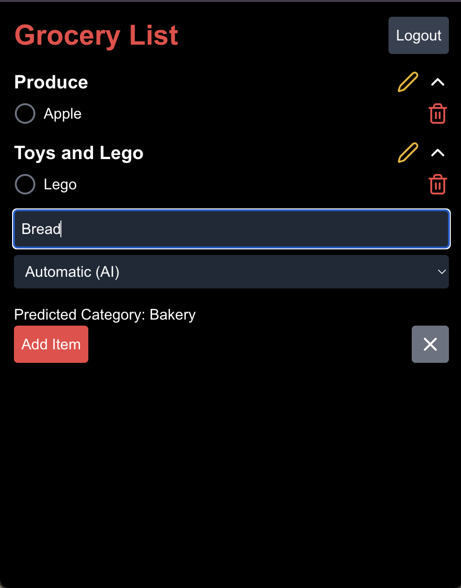

# Grocery List App

This project is a full-stack Grocery List app with an intelligent interface designed to enhance the grocery shopping experience. It features a React frontend and a Flask backend. The app not only allows users to create and manage grocery lists but also leverages AI to predict item categories, making the process efficient and personalized.

## Features

- **User Authentication**: Provides secure login and signup functionality.
- **AI-Driven Categorization**: Automatically predicts the category for each grocery item as you type, helping users organize items faster.
- **Flexible Categorization Options**: Users can override AI predictions and manually assign items to categories, providing control over the categorization process.
- **Real-Time Predictions**: The app responds in real-time, offering immediate categorization suggestions without delays.
- **Personalized Learning**: The AI model adapts over time, learning from user overrides to improve future predictions.
- **Usability and Flexibility**: Supports flexibility principles, such as dialog initiative, multi-threading, and task migratability, allowing users to switch between AI-driven and manual modes.



## Project Methodology

This project was developed in phases to ensure a user-centered design:

1. **Requirement Extraction**: Based on a survey of 16 participants, mostly university students and postgraduates, essential features were identified, such as quick item entry, effective categorization, and AI-driven suggestions. 
   
2. **Low-Fidelity Prototype**: A low-fidelity prototype was created to visualize the main interactions and functionalities, providing a foundation for design decisions.

3. **Hard-Coded Baseline Version**: A non-AI version was first developed, allowing users to manually assign categories. This version established a baseline for comparison with the AI-enhanced version.

4. **AI Integration**: A logistic regression model, enhanced with Word2Vec embeddings, was integrated to predict item categories. The model is retrained based on user behavior, allowing it to adapt to individual preferences.

5. **User Testing**: A user study with 12 participants tested both versions of the app. The AI-enabled version significantly reduced task completion time and improved user satisfaction.

## Key Results from User Testing

- **Task Completion Time**: The AI-enabled version reduced task completion time by 40-50% compared to the manual version.
- **User Emotions**: Positive emotions like satisfaction, confidence, and interest increased significantly, while negative emotions like frustration and boredom decreased.
- **Flexibility**: The AI-enabled app effectively supported flexibility, allowing users to override predictions, control categorization, and personalize the experience.

 <!-- Example image inclusion for visual context -->

## Installation Guide

To streamline the setup process, you can use the provided `setup.sh` script to install dependencies and start the project.

### Using the Setup Script

1. Clone the repository:

   ```bash
   git clone https://github.com/Amir-Mohseni/grocery-list-app.git
   cd grocery-list-app
   ```

2. Run the setup script:

   ```bash
   bash setup.sh
   ```

   This script will:
   - Install Node.js dependencies
   - Set up the Python virtual environment and install Python dependencies
   - Start both the frontend and backend servers concurrently

### Manual Setup

If you prefer to install dependencies manually, follow these steps.

#### 1. Install Node.js Dependencies

In the project root, run:

```bash
npm install
```

#### 2. Install Python Dependencies

1. Navigate to the backend directory:

   ```bash
   cd src/backend
   ```

2. Create and activate a virtual environment:

   ```bash
   python3 -m venv venv
   source venv/bin/activate  # On Windows, use venv\Scripts\activate
   ```

3. Install Python packages:

   ```bash
   pip install -r requirements.txt
   ```

#### 3. Run the Project

To start both the frontend and backend servers, run:

```bash
npm run dev
```

- The React frontend will be available at [http://localhost:3000](http://localhost:3000).
- The Flask backend will be available at [http://localhost:5000](http://localhost:5000).

## Available Scripts

In the project directory, you can run:

### `npm run dev`

Runs both the React frontend and Flask backend concurrently in development mode.

### `npm run start`

Runs only the React frontend in development mode. Open [http://localhost:3000](http://localhost:3000) to view it in the browser.

### `npm run backend`

Runs only the Flask backend on [http://localhost:5000](http://localhost:5000).

## Directory Structure

- **src**: Contains all source code.
  - **src/backend**: Flask backend.
- **public**: Static assets for the frontend.
- **requirements.txt**: Python dependencies for the backend.
- **setup.sh**: Shell script to set up and start the project.

## Future Improvements

1. **Immersive Communication Technologies**: Augmented Reality (AR) could guide users to specific aisles in a grocery store, enhancing in-store navigation.
2. **Explainability Features**: A history section that displays the model's predictions and category probabilities can improve transparency and build user trust.
3. **Enhanced AI Capabilities**: Further training with diverse datasets and improved embeddings can boost the AI's prediction accuracy and adaptability.

## Learn More

To learn more about the tools used in this project:

- [React Documentation](https://reactjs.org/)
- [Flask Documentation](https://flask.palletsprojects.com/)
- [Tailwind CSS Documentation](https://tailwindcss.com/)

## License

This project is licensed under the MIT License. See the LICENSE file for details.

---

## `setup.sh` (Installation Script)

This script simplifies the setup process by installing all necessary dependencies and starting both the frontend and backend servers.

```bash
#!/bin/bash

echo "Setting up the Grocery List App..."

# Install Node.js dependencies
echo "Installing Node.js dependencies..."
npm install

# Set up Python virtual environment and install dependencies
echo "Setting up Python environment and installing dependencies..."
cd src/backend
python3 -m venv venv
source venv/bin/activate
pip install -r requirements.txt
cd ../../

# Start both frontend and backend servers
echo "Starting both frontend and backend servers..."
npm run dev
```

### Instructions for Using `setup.sh`

1. Make the script executable:

   ```bash
   chmod +x setup.sh
   ```

2. Run the script:

   ```bash
   ./setup.sh
   ```

This will install dependencies and start both servers.
